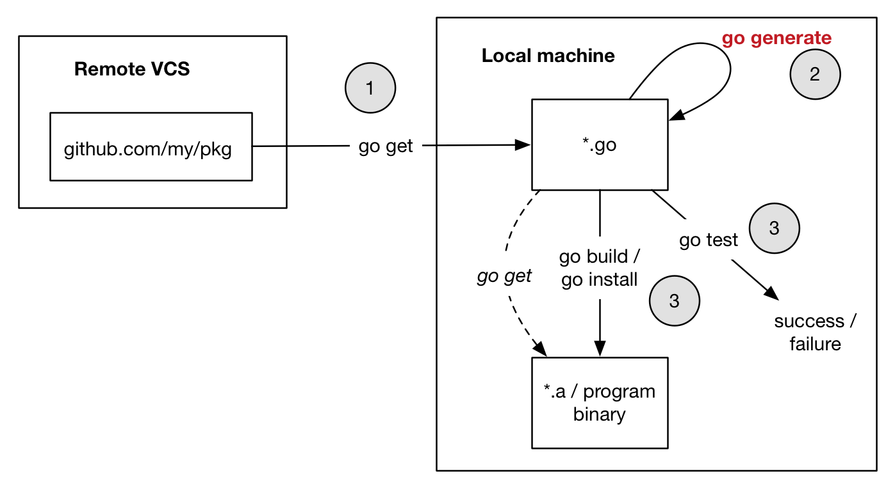

### Where does `go generate` fit into things?

`go generate` is best explained in the [introductory blog article](https://blog.golang.org/generate), but here is a diagram that gives a visual overview of where `go generate` is used in the development process, along with the other `go` commands:



The help for `go generate` is also critical reading:

```bash
$ go help generate
usage: go generate [-run regexp] [-n] [-v] [-x] [build flags] [file.go... | packages]

Generate runs commands described by directives within existing
files. Those commands can run any process but the intent is to
create or update Go source files.

Go generate is never run automatically by go build, go get, go test,
and so on. It must be run explicitly.

Go generate scans the file for directives, which are lines of
the form,

        //go:generate command argument...

...
```

### Glossary

* **[`go generate`](https://blog.golang.org/generate)** - a Go command that helps facilitate the generation of Go code from Go code
* A file that contains a `go generate` directive is referred to as a **source file** in the generation process. A generator may need to analyse the package to which the source file belongs; this is referred to as the **source package** in the generation progress
* A **generator** - a Go program that is capable of being run as a `go generate` directive command (i.e. understands the [environment in which `go generate` directives are called](https://golang.org/cmd/go/#hdr-Generate_Go_files_by_processing_source))
* A generator is either a **typed generator** or an **untyped generator**. Typed generators require type checking of the source file or package; untyped generators do not require any form of type checking (typically relying on analysis of [syntax trees](https://godoc.org/go/ast) alone)


### Tip: Regenerate files as part of CI

Whilst all generated files should be committed to your version control system (VCS), you should also have something approximating the following sequence as part of your CI build:

* delete all generated files
* regenerate
* verify that your commit is "clean" (i.e. the state of the repository matches that of the commit; in git terms, `git status --porcelain` returns nothing)

### Tip: Use a consistent naming strategy for generated files

Whether you are a human inspecting code, or a machine doing something with "all generated files", we need a way of quickly identifying generated files vs non-generated. Filenames are the most convenient means of so doing. So all generated files should start with a well-defined, common prefix: `gen_*`.

It should also be possible to tell from the filename which generator/other created the generated file; we use a suffix approach for this. For example the [Protocol Buffers](https://developers.google.com/protocol-buffers/) output files named `*.pb.go`. So in an ideal world, following the suggestion of a `gen_*` prefix, Protocol Buffers-generated files would instead of have output files called `gen_*.pb.go` - the prefix tells us the file is generated, the extension supplement tells us (by loose convention) that it's a `pb` (ProtoBuf) file. Similarly, for [`sortGen`](https://github.com/myitcv/sorter/tree/master/cmd/sortGen), generated files are of the format `gen_*.sortGen.go`

Having a consistent naming strategy also makes it easier to identify files to ignore from checks like `go lint`

All that said, it's also useful to have a well-defined comment within the file too. [This proposal](https://github.com/golang/go/issues/13560#issuecomment-277804473) outlines that the format should match the following case-sensitive regular expression:

```go
`^// Code generated .* DO NOT EDIT\.$`
```

Such a comment must appear as the first line of a properly formatted Go `//` comment, and that comment must appear before but not be attached to the package clause and before any `/* */` comment. This is similar to the rules for build tags.

### Tip: Make sure your generators are idempotent

A non-idempotent generator will generally be caught by regenerating files as part of your CI (see above). The checklist generally involves:

* not including anything date/time related in the output
* when generating output based on unordered collection structures (like maps), iterate through a total ordering of, for example, the keys to ensure the output order is consistent

### Tip: Generate code from generated output

It is entirely legitimate to generate code that itself becomes a source for a further code generation iteration. Use something like [`gogenerate`](https://myitcv.io/cmd/gogenerate) to automate the chaining and iteration towards a fixed point.

Equally, it is entirely possible to use generators in the construction of other generators. The only constraint here is that the dependency graph is not (currently) calculated automatically by `gogenerate`.'

### Tip: Use a common logging verbosity flag

All generators should ideally be able to understand a well-defined, common log verbosity flag: we suggest [`-gglog` (`go generate` log)](https://godoc.org/github.com/myitcv/gogenerate#LogFlag). This can then be controlled via [log levels](https://godoc.org/github.com/myitcv/gogenerate#LogLevel)

### TODO: flesh out these points

* New behaviour of `gogenerate` with respect to deleting untyped gen files
* Agree common flags for being verbose... e.g. `-ggv=warning` then use argument expansion (but keep it simple) - select from info, warning, error, and fatal
* Define whether a generator is package level; that is it only needs to be invoked once (because it scan's the entire package), file level, or other (type level etc)
* If the template for the generation includes references to any types defined in external packages then it makes sense to do some sort of file-based approach... because this way you can trivially have a generated equivalent that has the same imports
* Work out at what level it makes sense to gather from your templates; then in a separate phase generate from the gathered values
* Can use command form... but this is only per file. So sometimes annotations using other identifiers (e.g. immutableGen) more useful
* Have generators log with a prefix of the generator name (for all lines of output)
* Refer to github.com/myitcv/gogenerate package
* Document that `sortGen` and `immutableGen` are package level generators
* Generator should never have to worry about removing files... leave that to `gogenerate`
* Format the output... because it's nice to be able to read the generated output. Indeed best to `imports` format it, otherwise if you do that as part of wider CI-esque script the files can change _outside_ of `gogenerate`... which means that if you end up re-running `gogenerate` immediately afterwards it detects changes that didn't previously exist. If the formatting fails, write the unformatted code (so it can be inspected) and log a message to that effect
* When `go generate` says it will run with the package name, it really means the name; not the import path
* Different level generators; determines where you need to put `go generate` directive for a given generator:
  * Declaration (e.g. type, function, method, const etc) - appears on/in/against declarations that are to be considered, e.g. `stringer`
  * File - appears in files which are to be considered `keyGen`
  * Package - appears at the file scope (potentially multiple times) but is then run _once) on all files in the package (hence making the multiple appearances redundant)
* Making generators package based has the advantage of speed; invoked less times per package...
* Comment on why `gogenerate.DefaultLogLevel` needs to exist; interplay of `go generate` command (argument) parsing and the `gogenerate` advice on passing log levels to generators
