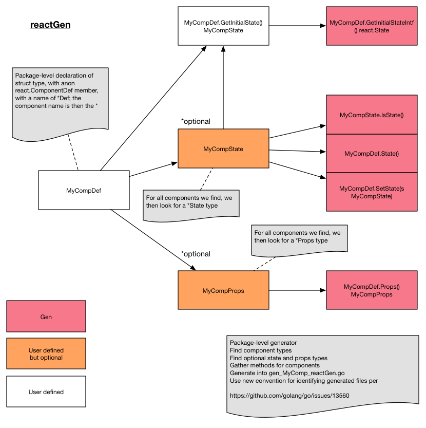

## Code generator design

### Design

### Assumptions

Largely covered in the docs for [creating a GopherJS app](creating_app.md).

Detail to follow here

### TODO

1. prevent state and props types from being `*js.Object`-special (and most importantly remember rationale for needing this...)
2. Reference use of `gg` or `gai` for making code generation an automatic part of workflow
3. Generate warnings for methods defined but with wrong types

